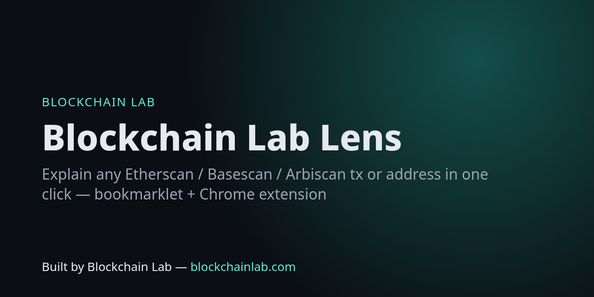

# Blockchain Lab Lens



**Explain any transaction, address or contract on Etherscan-family block explorers in one click** — decoded function call and arguments, decoded event logs, status and fees, EOA vs contract, proxy implementation (EIP-1967 / zeppelinos), EIP-7702 delegation, ENS names and ERC-20 metadata — powered by the free [Blockchain Lab Tools](https://blockchains.github.io/blockchainlab-tools/).

> Built by **Blockchain Lab — [blockchainlab.com](https://blockchainlab.com/?utm_source=github&utm_medium=readme&utm_campaign=blockchainlab-lens)**

**Install page (bookmarklet drag-link):** https://blockchains.github.io/blockchainlab-lens/

Supported explorers: etherscan.io, basescan.org, arbiscan.io, polygonscan.com, optimistic.etherscan.io, bscscan.com, snowtrace.io, and Blockscout for Ethereum / Base / Arbitrum / Polygon / Optimism.

## 1. Bookmarklet (any browser)

Open the [install page](https://blockchains.github.io/blockchainlab-lens/) and drag **🔍 BL Lens** to your bookmarks bar (GitHub strips `javascript:` links from READMEs, so it lives there). Source: [`bookmarklet/bookmarklet.src.js`](bookmarklet/bookmarklet.src.js); encoded form: [`bookmarklet/bookmarklet.txt`](bookmarklet/bookmarklet.txt).

## 2. Chrome / Edge / Brave extension (Manifest V3)

1. Download `blockchainlab-lens.zip` from [Releases](https://github.com/Blockchains/blockchainlab-lens/releases/latest) and unzip it, or clone this repo.
2. Go to `chrome://extensions`, turn on **Developer mode**, click **Load unpacked** and pick the `extension/` folder.
3. On any explorer `/tx/0x…`, `/address/0x…` or `/token/0x…` page, click **Explain · Blockchain Lab** (bottom right).
4. Or highlight any hash / address / ENS name on any page → right-click → **Explain with Blockchain Lab**. The toolbar popup takes any hash, address, ENS name or calldata.

Permissions: `contextMenus` only, plus a content script on the explorer domains. No analytics, no data collection, no backend.

> If an explorer page is showing a Cloudflare "verify you are human" screen, its security headers block embedded frames. Finish the check, or use **open in tab ↗** in the panel header.

## Tests

[`test_extension.py`](test_extension.py) loads the real unpacked extension in Chromium and checks the button, panel and bookmarklet on Etherscan, Basescan, Arbiscan and Polygonscan URLs. The embedded tools page has to render **live** on-chain data (USDC contracts, plus a real recent Polygon tx). Explorer HTML is stubbed via request routing because explorers put headless browsers behind a Cloudflare check. The extension only reads the URL, which is the real one. CI runs it on every push ([extension-tests](.github/workflows/test.yml)).

```bash
pip install playwright && python -m playwright install chromium && python test_extension.py
```

## Related

[Blockchain Lab Tools](https://github.com/Blockchains/blockchainlab-tools) · [Open Data API](https://github.com/Blockchains/blockchainlab-api) · [MCP server](https://github.com/Blockchains/blockchainlab-mcp) · [Labs](https://github.com/Blockchains/blockchainlab-labs)

MIT. Not financial advice.

---
Built by Blockchain Lab — [blockchainlab.com](https://blockchainlab.com/?utm_source=github&utm_medium=readme&utm_campaign=blockchainlab-lens)
